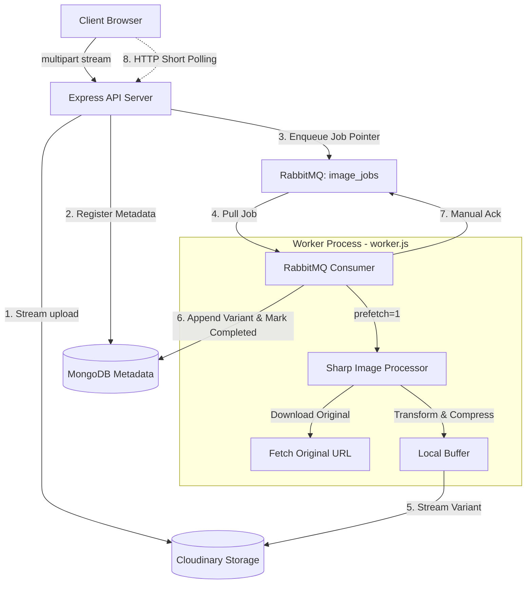

# PixelForge Async

PixelForge Async is a high-performance, production-ready, asynchronous image-processing web application. By decoupling high-throughput I/O ingestion from heavy CPU-bound image transformations, PixelForge achieves predictable memory usage, flat CPU utilization, and extreme resiliency under load.

The system uses **Express** as the producer web API, **RabbitMQ (CloudAMQP)** as the load-leveling shock-absorber queue, **Sharp (libvips)** running in a isolated **Worker process** as the consumer, **MongoDB** for denormalized single-disk-read metadata storage, and **Cloudinary** for zero-disk asset hosting.

---

## 🗺️ System Topology



---

## 💎 Core Architecture & Design Decisions

Every feature of PixelForge Async is architected to avoid common pitfalls in Node.js-based backends under heavy scaling. Below is a comparison of our production-ready design decisions against naive implementations.

### 1. Ingestion: Zero-Disk Streaming
* **Naive Approach (Before):** Buffering the entire file in RAM using middleware like `multer.memoryStorage()`.
  * *The Problem:* Uploading a few large images (e.g. 100MB each) concurrently triggers Heap Out-Of-Memory (OOM) server crashes.
* **PixelForge Approach (After):** Utilizing `busboy` to parse incoming multipart streams and pipe chunks directly to Cloudinary.
  * *The Solution:* The server acts as a **conduit**, not a buffer. Memory footprint remains at a constant a few KB per stream, regardless of file size ($O(1)$ memory consumption).

### 2. Process Isolation: Decoupled API & Worker
* **Naive Approach (Before):** Running image transformations inline within the Express request handler.
  * *The Problem:* Node.js is single-threaded. CPU-heavy operations (like resizes and crops via `sharp`) block the event loop, causing all concurrent requests to freeze and time out.
* **PixelForge Approach (After):** Running the Express API server (`server.js`) and the processing worker (`worker.js`) in separate OS processes.
  * *The Solution:* The OS scheduler assigns separate CPU slices to each process. The worker can operate at 100% CPU utilization during heavy resizes without blocking request processing on the API.

### 3. Queueing: Shock Absorption
* **Naive Approach (Before):** Tightly coupling the API requests directly to transformation execution.
  * *The Problem:* A traffic spike of 1,000 requests causes 1,000 concurrent CPU-heavy operations, leading to database connection drops and server locks.
* **PixelForge Approach (After):** The API accepts the request, validates the payload bounds, pushes a metadata pointer to RabbitMQ, and returns a `202 Accepted` status within $<20\text{ ms}$.
  * *The Solution:* Egress rate is decoupled from ingress rate. Traffic spikes are converted into manageable queue backlogs rather than immediate system failures.

### 4. Delivery Guarantees: `prefetch(1)` & Manual Acknowledgment
* **Naive Approach (Before):** Round-robin dispatching with automatic acknowledgments (`noAck: true`).
  * *The Problem:* RabbitMQ dumps all pending jobs onto the worker. The worker crashes under memory overload, and all unfinished jobs are lost permanently.
* **PixelForge Approach (After):** Fetching exactly one job at a time via `channel.prefetch(1)` and using manual acknowledgments (`noAck: false`).
  * *The Solution:* The worker pulls a message, processes it, saves the status to MongoDB, uploads the variant, and only then acknowledges it. If the worker crashes, RabbitMQ automatically re-queues the message, guaranteeing **at-least-once delivery**.

### 5. Data Modeling: Denormalized Schema
* **Naive Approach (Before):** Normalizing the database schema where each transformed variant is stored as a row in a separate collection.
  * *The Problem:* Fetching a user's dashboard of images and variants requires complex JOINs or multiple queries, severely degrading read performance at scale.
* **PixelForge Approach (After):** Storing variants inside an embedded array (`variants[]`) within the main image document in MongoDB.
  * *The Solution:* Retrieving a document and all its variants is resolved in a **single disk read**, maximizing throughput and lowering latency.

---

## 🛠️ Technology Stack

### Backend
* **Runtime:** Node.js (ES Modules syntax)
* **Framework:** Express
* **Database:** MongoDB & Mongoose
* **Message Broker:** RabbitMQ (via CloudAMQP)
* **Cache/Diagnostic:** Upstash Serverless Redis
* **Image Processing:** Sharp (libvips C++ binding)
* **File Processing:** Busboy (multipart stream parsing)

### Frontend
* **Build System:** Vite
* **Library:** React (Single Page Application)
* **Icons:** Lucide React
* **Styling:** CSS Utilities / Tailwind CSS

---

## 📂 Project Structure

```
├── config/                 # Shared infrastructure configurations
│   ├── cloudamqp.js        # RabbitMQ broker connection
│   ├── cloudinary.js       # Cloudinary media storage initialization
│   ├── db.js               # MongoDB Mongoose connection client
│   └── upstash.js          # Upstash Serverless Redis config & diagnostic pinger
├── controllers/            # Express request handlers
│   ├── authController.js   # User registration & JWT authentication
│   └── imageController.js  # Zero-disk upload stream & RMQ job dispatch
├── middleware/             # Express middlewares
│   └── auth.js             # JWT verification & tenant isolation
├── models/                 # Mongoose schemas
│   ├── Image.js            # Embedded variant image document structure
│   └── User.js             # User credentials schema
├── routes/                 # Express router declarations
│   ├── authRoutes.js       # Authentication routes
│   └── imageRoutes.js      # Upload, transform, status & download routes
├── frontend/               # React + Vite client application
│   ├── src/
│   │   ├── components/
│   │   │   ├── Auth.jsx        # Login & SignUp UI forms
│   │   │   └── Dashboard.jsx   # Interactive canvas cropper & controls
│   │   ├── App.jsx             # Entry view state control
│   │   └── main.jsx            # DOM mounting entrypoint
│   └── package.json
├── worker.js               # Standalone queue consumer & Sharp processor
├── server.js               # API Server entry point
├── package.json            # Backend package manifest
└── .env.example            # Template for required environment secrets
```

---

## 🚀 Getting Started

### Prerequisites
* **Node.js** (v18 or higher recommended)
* **MongoDB** (Local instance or MongoDB Atlas URI)
* **RabbitMQ** (Local instance or CloudAMQP subscription)
* **Cloudinary Account** (For image storage)
* **Upstash Redis** (Optional, used for cache configuration)

### Environment Configuration
1. Copy the `.env.example` template:
   ```bash
   cp .env.example .env
   ```
2. Populate the `.env` file with your credentials:
   ```env
   PORT=5000
   DATABASE_URL=mongodb+srv://...
   CLOUDAMQP_URL=amqps://...
   CLOUDINARY_URL=cloudinary://...
   JWT_SECRET=your_secret_signing_key
   UPSTASH_REDIS_REST_URL=https://...
   UPSTASH_REDIS_REST_TOKEN=...
   ```

### Installation
1. Install dependencies for the **Backend & Worker**:
   ```bash
   npm install
   ```
2. Install dependencies for the **Frontend**:
   ```bash
   cd frontend
   npm install
   cd ..
   ```

### Running the Application

To run the application locally, you must boot the **API Server**, the **Worker Process**, and the **Vite Dev Server**.

#### Option A: Running in separate terminal windows (Recommended for development)
1. **API Server:**
   ```bash
   npm run dev
   ```
2. **Worker Process:**
   ```bash
   node worker.js
   ```
3. **Frontend Server:**
   ```bash
   cd frontend
   npm run dev
   ```

#### Option B: Running under PM2 (Recommended for production emulation)
Install PM2 globally and start both backend threads:
```bash
npm install -g pm2
pm2 start server.js --name "pixelforge-api"
pm2 start worker.js --name "pixelforge-worker"
```

---

## 🔮 Future Improvements & Roadmap

While PixelForge Async is robust, several design tradeoffs were made for simplicity. The following features are planned for future versions to achieve enterprise-grade security and scalability:

1. **Server-Sent Events (SSE) / WebSockets:** Replacing the current HTTP short polling ($2\text{s}$ interval) on the frontend. By integrating SSE linked to Redis Pub/Sub, the client will receive real-time completions without overhead.
2. **HttpOnly Cookie JWT Storage:** Storing authentication tokens in secure, `HttpOnly` cookies to protect against token theft via Cross-Site Scripting (XSS) attacks.
3. **Unbounded Stream Protection:** Setting hard limits on `busboy` (e.g. `fileSize: 25MB`) to reject oversized file streams immediately and prevent Denial of Service (DoS) attempts.
4. **Decoupled Key Storage (Anti Vendor-Lock):** Storing relative storage paths in the database instead of absolute Cloudinary URLs, and wrapping media delivery behind a CDN proxy (e.g., Cloudflare) to support transparent storage migration.
5. **RabbitMQ Dead Letter Queue (DLQ):** Implementing a Dead Letter Exchange (DLX) with exponential backoff retries to handle transient processing errors gracefully before failing a job.
6. **Token Revocation (Blacklisting):** Storing revoked JWTs in Redis with a TTL matching the token's validity duration to ensure logout sessions are invalidated server-side.
7. **Schema Validation Middleware:** Migrating manual validation logic from inside the controller files to pre-route validation schemas using a library like **Zod** or **Joi**.
8. **Rate Limiting & Password Security:** Enforcing password complexity validations (length, character mixture) and adding rate limiters (e.g. `express-rate-limit`) on auth endpoints to prevent brute-force attacks.
